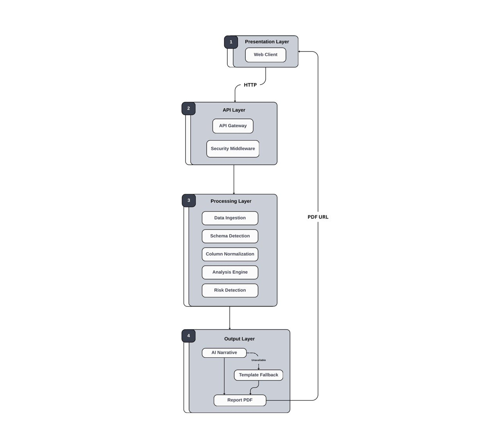

  

  <strong>Automated Financial Intelligence and Risk Analysis Platform</strong>

  
  
  
  
  

---

## Product Overview

Nebras transforms raw financial data into executive-ready insights and professional PDF reports. The platform combines deterministic data processing with AI-assisted narrative generation to deliver CFO-level reporting in seconds.

---

## What the Platform Does

- **Intelligent Ingestion** Automatically detects transaction ledgers or P&L statements and normalizes column names
- **Deterministic Analysis** Calculates KPIs with zero tolerance for computational error
- **Risk Detection** Identifies anomalies such as negative margins and expense spikes
- **Executive Reporting** Generates board-ready PDF reports with AI-drafted recommendations

## System Architecture

  

<em>High-level system architecture (Frontend → API → Processing → Output).</em>

See [Architecture Documentation](docs/architecture.md) for details.

## How It Works

  

<em>End-to-end processing flow from upload to PDF delivery.</em>

| Step        | Description                            |
| ----------- | -------------------------------------- |
| 1. Upload   | User submits CSV or Excel file         |
| 2. Validate | File type, size, and rate limit checks |
| 3. Detect   | Automatic schema identification        |
| 4. Analyze  | KPI calculation and trend analysis     |
| 5. Scan     | Risk pattern detection                 |
| 6. Generate | PDF report with AI narrative           |
| 7. Deliver  | JSON response with download URL        |

See [System Flow](docs/system-flow.md) for the complete processing pipeline.

---

## Technology Stack

| Layer       | Technology                     |
|------------|--------------------------------|
| Frontend   | Vue 3, Vite, SCSS              |
| Backend    | FastAPI, Python                |
| Analysis   | Pandas, NumPy                  |
| AI Layer   | LLM-based narrative generation |
| Reporting  | Playwright, Jinja2             |

---

## Quick Start

### Backend

~~~bash
cd server
python -m venv .venv
source .venv/bin/activate  # Windows: .venv\Scripts\activate
pip install -r requirements.txt
python -m playwright install chromium
uvicorn main:app --reload --host 0.0.0.0 --port 8000
~~~

### Frontend

~~~bash
npm install
npm run dev
~~~

The application will be available at:  
- Frontend: http://localhost:5173  
- Backend API: http://localhost:8000

---

## Input Formats

| Schema       | Required Columns         |
| ------------ | ------------------------ |
| Transactions | Date, Amount, Category   |
| P&L          | Month, Revenue, Expenses |

Column names are flexible the system recognizes common variants automatically.

---

## API

| Endpoint              | Method | Description                       |
| --------------------- | ------ | --------------------------------- |
| `/api/analyze`        | POST   | Upload and analyze financial data |
| `/reports/{filename}` | GET    | Download generated PDF            |
| `/health`             | GET    | API status check                  |

See [API Reference](docs/api.md) for full documentation.

---

## Security

- **Ephemeral Processing** Data processed in memory, discarded after analysis
- **Rate Limiting** IP-based request throttling
- **Input Validation** Strict file type and size enforcement

---

---

## License

This project is licensed under the MIT License.

