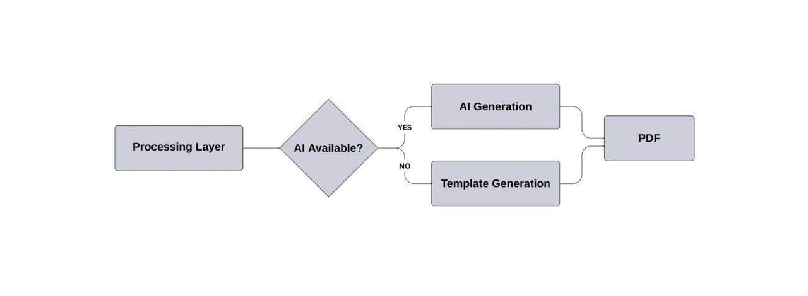

## System Architecture

Nebras employs a modular, layered architecture separating presentation, processing, and output generation.

---

## Architecture Overview

The following diagram illustrates the high-level system architecture of Nebras, showing the interaction between the presentation, API, processing, and output layers, starting from the web client and ending with PDF report generation.

The architecture follows a unidirectional flow where each layer has a clearly defined responsibility, ensuring separation of concerns and deterministic processing.

---

## Layer Descriptions

### Presentation Layer

**Technology:** Vue 3, Vite  

Provides file upload, analysis status, and report download.  
This layer contains no business logic; all processing is handled server-side.

---

### API Layer

**Technology:** FastAPI  

Handles request validation, routing, and security enforcement, including:

- File type whitelisting (CSV, XLSX, XLS)
- File size limit enforcement (10 MB)
- IP-based rate limiting

---

### Processing Layer

**Technology:** Pandas, NumPy  

Responsible for all deterministic data processing and analysis.

| Component            | Responsibility                        |
| -------------------- | ------------------------------------- |
| Data Ingestion       | Parse CSV/Excel into DataFrames       |
| Schema Detection     | Identify transaction or P&L structure |
| Column Normalization | Map variable column names to a schema |
| Analysis Engine      | Calculate KPIs, trends, and deltas    |
| Risk Detection       | Rule-based anomaly detection          |

All calculations are deterministic, and no arbitrary values are generated.

---

### Output Layer

**AI Narrative:**  
LLM-based narrative generation that transforms finalized metrics into executive summaries and recommendations.  
The AI receives only computed values and never performs calculations.

**Template Fallback:**  
If the AI service is unavailable, the system automatically switches to template-based generation.

---

## Graceful Degradation

The following diagram shows how the system ensures report delivery when AI services are unavailable.

When AI generation is not available, the system falls back to deterministic templates, ensuring consistent and reliable output.

---

### PDF Renderer

**Technology:** ReportLab  

Compiles metrics, charts, and narrative content into a professional PDF report, which is then returned to the client as a downloadable URL.

---

## Security Boundaries

| Boundary   | Enforcement                          |
| ---------- | ------------------------------------ |
| Input      | File validation before processing    |
| Processing | Sanitized data only reaches analysis |
| Output     | No raw source data embedded in PDF   |

---

## Scalability

- Stateless design: each request is processed independently  
- Horizontal scalability: multiple instances can run concurrently  
- Memory bounded: file size limits prevent resource exhaustion  

---

## Design Principles

| Principle              | Implementation                      |
| ---------------------- | ----------------------------------- |
| Separation of Concerns | Clear layer responsibility          |
| Deterministic Accuracy | Proven numerical libraries          |
| Graceful Degradation   | Template fallback guarantees output |
| Ephemeral Processing   | No persistent customer data         |

