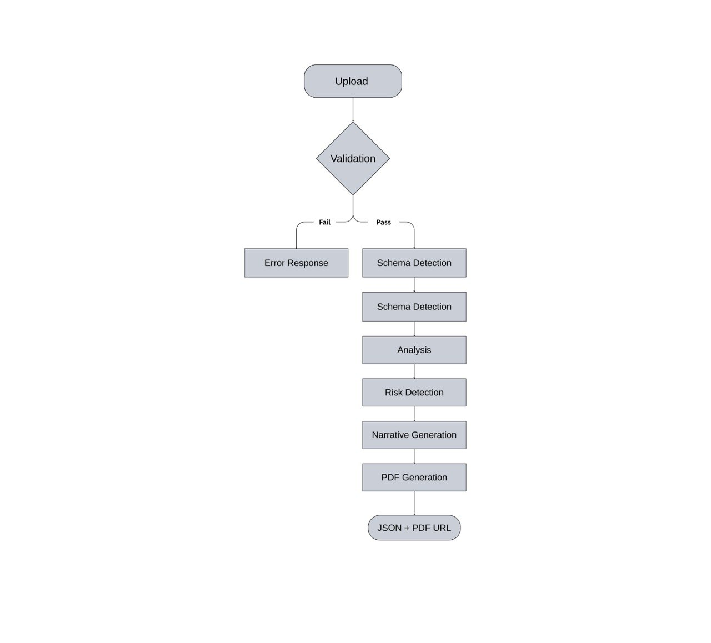

# System Flow

End-to-end processing pipeline from file upload to report delivery.

---

## Flow Diagram



---

## Stage Descriptions

### 1. Upload

User submits CSV or Excel file via the web interface.

- Client validates file extension and size
- File transmitted as multipart form data to `/api/analyze`

### 2. Validation

Server performs security checks:

| Check       | Failure Response      |
| ----------- | --------------------- |
| Rate limit  | 429 Too Many Requests |
| File type   | 400 Bad Request       |
| File size   | 413 Payload Too Large |
| Parse error | 400 Bad Request       |

### 3. Schema Detection

System analyzes column headers:

| Schema      | Indicators                       |
| ----------- | -------------------------------- |
| Transaction | Date, Amount, Category columns   |
| P&L         | Month, Revenue, Expenses columns |

### 4. Normalization

Variable column names mapped to standard schema:

```
Transaction_Date → date
Total Amount → amount
REVENUE → revenue
```

### 5. Analysis

KPI calculation:

| Metric        | Description               |
| ------------- | ------------------------- |
| Total Revenue | Sum of revenue            |
| Net Profit    | Revenue minus expenses    |
| Profit Margin | Net profit / revenue      |
| Growth        | Period-over-period change |

### 6. Risk Detection

Rule-based scanning:

| Rule            | Condition    |
| --------------- | ------------ |
| Low Margin      | Margin < 10% |
| Expense Spike   | Growth > 20% |
| Negative Profit | Net < 0      |

### 7. Narrative Generation

AI drafts executive summary and recommendations from calculated metrics. Falls back to templates if AI unavailable.

### 8. PDF Generation

ReportLab compiles:

- Executive summary
- KPI dashboard
- Trend charts
- Risk assessment
- Recommendations

### 9. Response

API returns:

```json
{
  "summary": "...",
  "kpis": [...],
  "risks": [...],
  "recommendations": [...],
  "report_pdf_url": "/reports/report_xxx.pdf"
}
```

---

## Error Handling

| Stage      | Error          | Status |
| ---------- | -------------- | ------ |
| Rate Limit | Quota exceeded | 429    |
| Validation | Invalid file   | 400    |
| Validation | File too large | 413    |
| Detection  | Unknown format | 400    |
| Processing | Failure        | 500    |

---

## Processing Times

| File Size     | Duration |
| ------------- | -------- |
| < 100 KB      | 2-3s     |
| 100 KB - 1 MB | 3-5s     |
| 1 - 5 MB      | 5-10s    |
| 5 - 10 MB     | 10-20s   |
